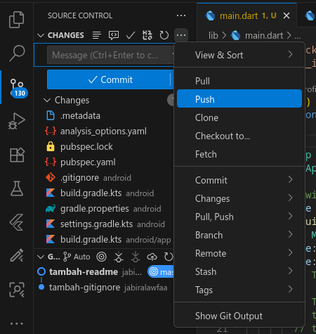

# LAPORAN PRAKTIKUM MOBILE DEVELOPMENT

## PRAKTIKUM 1 : Membuat Project Flutter Baru

### Langkah-langkah Praktikum

1. Buat Proyek baru dengan extensi Flutter, panggil command pallete dengan F1 dan tulis flutter: 

    

2. pilih aplications dan buat folder khusus untuk proyeknya

    
    

3. beri nama proyek lalu enter dan tunggu hingga generate proyek flutter selesai

    
    

## PRAKTIKUM 2 : Menghubungkan Perangkat Android atau Emulator
(saya disini harus memakai chrome, dikarenakan harus menunggu lama saat meghubungkanya ke handphone)

### Langkah-langkah Praktikum

1. pilih device di menu pojok kanan bawah dan pilih chrome

    
    

2. lalu klik run & debug dan lihat hasilnya

    

## PRAKTIKUM 3 : Membuat Repository GitHub dan Laporan Praktikum

### Langkah-langkah Praktikum

1. buat repo di github dan beri nama lalu create

    

    

2. masuk ke vscode dan masuk menu Source control, disana tambah .gitignore dan commit dengan nama tambah-gitignore

    

3. lalu pilih menu 3 titik dan pilih push, lalu di menu pojok bawah kanan di pemberitahuan klik add remote

    

    

4. lalu copy dan paste URL repo github nya(boleh menggunakan URL SSH)

    

5. lalu beri nama remote, disini saya pakai origin saja karena default

    

6. melakukan hal serupa dengan file readme.md (karena tadi sudah menyetel URL remote github dan membuat nama remote, kita tidak perlu mengisi lagi)

    
    

7. kali ini tambah semua dengan klik `+` pada changes dan commit dengan nama commit lalu push seperti tadi

    
    

8. hasilnya bisa kita lihat di github

    

## PRAKTIKUM 4 Menerapkan Widget Dasar

### Langkah-langkah Praktikum

1. buat code untuk widget text
    code contoh (saya ambil dari web codelabs):
    ```dart
    import 'package:flutter/material.dart';

    class MyTextWidget extends StatelessWidget {
    const MyTextWidget({Key? key}) : super(key: key);

    @override
    Widget build(BuildContext context) {
        return const Text(
        "Nama saya Fulan, sedang belajar Pemrograman Mobile",
        style: TextStyle(color: Colors.red, fontSize: 14),
        textAlign: TextAlign.center);
    }
    }
    ```

    code penerapan saya

    


    hasil

    

2. buat code untuk widget image
    code contoh (saya ambil dari web codelabs):
    ```dart
    import 'package:flutter/material.dart';

    class MyImageWidget extends StatelessWidget {
    const MyImageWidget({Key? key}) : super(key: key);

    @override
    Widget build(BuildContext context) {
        return const Image(
        image: AssetImage("logo_poliwangi.jpg")
        );
    }
    }
    ```

    hasil penerapan saya
    

    

    

## PRAKTIKUM 5 

### Langkah-langkah Praktikum

1. membuat file cupertino button dan loading bar

    contoh code di codelabs
    ```dart
    return MaterialApp(
      home: Container(
        margin: const EdgeInsets.only(top: 30),
        color: Colors.white,
        child: Column(
          children: <Widget>[
            CupertinoButton(
              child: const Text("Contoh button"),
              onPressed: () {},
            ),
            const CupertinoActivityIndicator(),
          ],
        ),
      ),
    );
    ```

    penerapan saya

    

2. membuat Floating Action Button (FAB)

    contoh code di codelabs
    ```dart
    return MaterialApp(
      home: Scaffold(
        floatingActionButton: FloatingActionButton(
          onPressed: () {
            // Add your onPressed code here!
          },
          child: const Icon(Icons.thumb_up),
          backgroundColor: Colors.pink,
        ),
      ),
    );
    ```

    penerapan saya

    

3. membuat scaffold widget

    contoh di codelabs
    ```dart
    import 'package:flutter/material.dart';

    void main() {
    runApp(const MyApp());
    }

    class MyApp extends StatelessWidget {
    const MyApp({Key? key}) : super(key: key);

    // This widget is the root of your application.
    @override
    Widget build(BuildContext context) {
        return MaterialApp(
        title: 'Flutter Demo',
        theme: ThemeData(
            primarySwatch: Colors.red,
        ),
        home: const MyHomePage(title: 'My Increment App'),
        );
    }
    }

    class MyHomePage extends StatefulWidget {
    const MyHomePage({Key? key, required this.title}) : super(key: key);

    final String title;

    @override
    State<MyHomePage> createState() => _MyHomePageState();
    }

    class _MyHomePageState extends State<MyHomePage> {
    int _counter = 0;

    void _incrementCounter() {
        setState(() {
        _counter++;
        });
    }

    @override
    Widget build(BuildContext context) {
        return Scaffold(
        appBar: AppBar(
            title: Text(widget.title),
        ),
        body: Center(
            child: Column(
            mainAxisAlignment: MainAxisAlignment.center,
            children: <Widget>[
                const Text(
                'You have pushed the button this many times:',
                ),
                Text(
                '$_counter',
                style: Theme.of(context).textTheme.headline4,
                ),
            ],
            ),
        ),
        bottomNavigationBar: BottomAppBar(
            child: Container(
            height: 50.0,
            ),
        ),
        floatingActionButton: FloatingActionButton(
            onPressed: _incrementCounter,
            tooltip: 'Increment Counter',
            child: const Icon(Icons.add),
        ),
        floatingActionButtonLocation: FloatingActionButtonLocation.centerDocked,
        );
    }
    }
    ```

    hasil tampilan

    

4. membuat dialog widget

    contoh code di codelabs
    ```dart
    class MyApp extends StatelessWidget {
    const MyApp({Key? key}) : super(key: key);

    @override
    Widget build(BuildContext context) {
        return const MaterialApp(
        home: Scaffold(
            body: MyLayout(),
        ),
        );
    }
    }

    class MyLayout extends StatelessWidget {
    const MyLayout({Key? key}) : super(key: key);

    @override
    Widget build(BuildContext context) {
        return Padding(
        padding: const EdgeInsets.all(8.0),
        child: ElevatedButton(
            child: const Text('Show alert'),
            onPressed: () {
            showAlertDialog(context);
            },
        ),
        );
    }
    }

    showAlertDialog(BuildContext context) {
    // set up the button
    Widget okButton = TextButton(
        child: const Text("OK"),
        onPressed: () {
        Navigator.pop(context);
        },
    );

    // set up the AlertDialog
    AlertDialog alert = AlertDialog(
        title: const Text("My title"),
        content: const Text("This is my message."),
        actions: [
        okButton,
        ],
    );

    // show the dialog
    showDialog(
        context: context,
        builder: (BuildContext context) {
        return alert;
        },
    );
    }
    ```

    penerapan saya

    

    

    

5. membuat input dan selection widget

    contoh code di codelabs
    ```dart
    class MyApp extends StatelessWidget {
    const MyApp({Key? key}) : super(key: key);

    @override
    Widget build(BuildContext context) {
        return MaterialApp(
        home: Scaffold(
            appBar: AppBar(title: const Text("Contoh TextField")),
            body: const TextField(
            obscureText: false,
            decoration: InputDecoration(
                border: OutlineInputBorder(),
                labelText: 'Nama',
            ),
            ),
        ),
        );
    }
    }
    ```

    hasil penerapan saya

    

6. membuat date and time picker

    contoh code di codelabs
    ```dart
    import 'dart:async';
    import 'package:flutter/material.dart';

    void main() => runApp(const MyApp());

    class MyApp extends StatelessWidget {
    const MyApp({Key? key}) : super(key: key);

    @override
    Widget build(BuildContext context) {
        return const MaterialApp(
        title: 'Contoh Date Picker',
        home: MyHomePage(title: 'Contoh Date Picker'),
        );
    }
    }

    class MyHomePage extends StatefulWidget {
    const MyHomePage({Key? key, required this.title}) : super(key: key);

    final String title;

    @override
    _MyHomePageState createState() => _MyHomePageState();
    }

    class _MyHomePageState extends State<MyHomePage> {
    // Variable/State untuk mengambil tanggal
    DateTime selectedDate = DateTime.now();

    //  Initial SelectDate FLutter
    Future<void> _selectDate(BuildContext context) async {
        // Initial DateTime FIinal Picked
        final DateTime? picked = await showDatePicker(
            context: context,
            initialDate: selectedDate,
            firstDate: DateTime(2015, 8),
            lastDate: DateTime(2101));
        if (picked != null && picked != selectedDate) {
        setState(() {
            selectedDate = picked;
        });
        }
    }

    @override
    Widget build(BuildContext context) {
        return Scaffold(
        appBar: AppBar(
            title: Text(widget.title),
        ),
        body: Center(
            child: Column(
            mainAxisSize: MainAxisSize.min,
            children: <Widget>[
                Text("${selectedDate.toLocal()}".split(' ')[0]),
                const SizedBox(
                height: 20.0,
                ),
                ElevatedButton(
                onPressed: () => {
                    _selectDate(context),
                    // ignore: avoid_print
                    print(selectedDate.day + selectedDate.month + selectedDate.year)
                },
                child: const Text('Pilih Tanggal'),
                ),
            ],
            ),
        ),
        );
    }
    }
    ```

    hasil penerapan saya

    