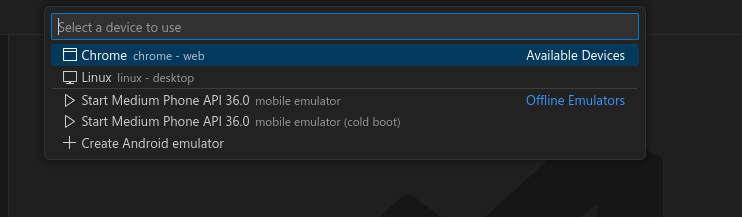

# LAPORAN PRAKTIKUM MOBILE DEVELOPMENT

## PRAKTIKUM 1 : Membuat Project Flutter Baru

### Langkah-langkah Praktikum

1. Buat Proyek baru dengan extensi Flutter, panggil command pallete dengan F1 dan tulis flutter: 

2. pilih aplications dan buat folder khusus untuk proyeknya

3. beri nama proyek lalu enter dan tunggu hingga generate proyek flutter selesai

## PRAKTIKUM 2 : Menghubungkan Perangkat Android atau Emulator
(saya disini harus memakai chrome, dikarenakan harus menunggu lama saat meghubungkanya ke handphone)

### Langkah-langkah Praktikum

1. pilih device di menu pojok kanan bawah dan pilih chrome

2. lalu klik run & debug dan lihat hasilnya

## PRAKTIKUM 3 : Membuat Repository GitHub dan Laporan Praktikum

### Langkah-langkah Praktikum

1. buat repo di github dan beri nama lalu create

2. masuk ke vscode dan masuk menu Source control, disana tambah .gitignore dan commit dengan nama tambah-gitignore

3. lalu pilih menu 3 titik dan pilih push, lalu di menu pojok bawah kanan di pemberitahuan klik add remote

4. lalu copy dan paste URL repo github nya(boleh menggunakan URL SSH)

5. lalu beri nama remote, disini saya pakai origin saja karena default

6. melakukan hal serupa dengan file readme.md (karena tadi sudah menyetel URL remote github dan membuat nama remote, kita tidak perlu mengisi lagi)

7. kali ini tambah semua dengan klik `+` pada changes dan commit dengan nama commit lalu push seperti tadi

8. hasilnya bisa kita lihat di github

## PRAKTIKUM 4 Menerapkan Widget Dasar

### Langkah-langkah Praktikum

1. buat code untuk widget text
    code contoh (saya ambil dari web codelabs):
    `import 'package:flutter/material.dart';

    class MyTextWidget extends StatelessWidget {
    const MyTextWidget({Key? key}) : super(key: key);

    @override
    Widget build(BuildContext context) {
        return const Text(
        "Nama saya Fulan, sedang belajar Pemrograman Mobile",
        style: TextStyle(color: Colors.red, fontSize: 14),
        textAlign: TextAlign.center);
    }
    }`

    code penerapan saya

    hasil

2. buat code untuk widget image
    code contoh (saya ambil dari web codelabs):
    `import 'package:flutter/material.dart';

    class MyImageWidget extends StatelessWidget {
    const MyImageWidget({Key? key}) : super(key: key);

    @override
    Widget build(BuildContext context) {
        return const Image(
        image: AssetImage("logo_poliwangi.jpg")
        );
    }
    }`
